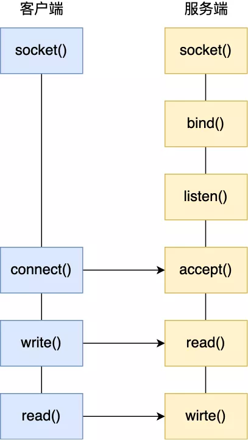
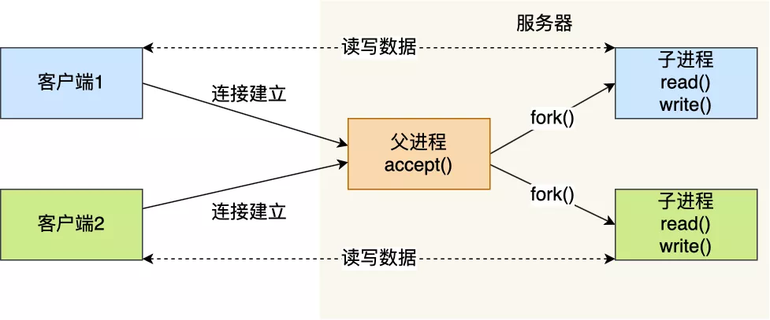
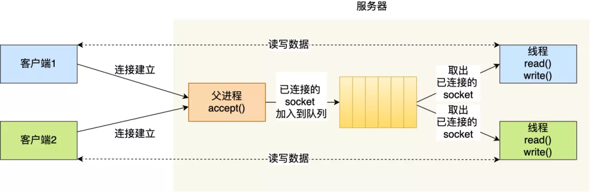
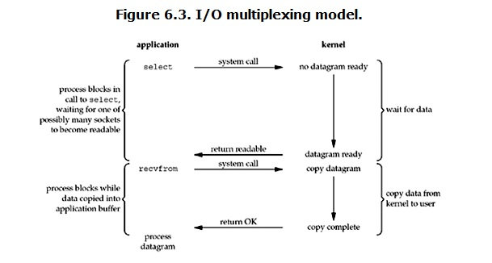
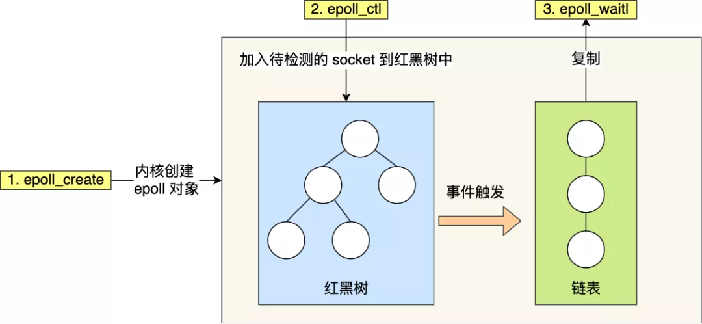

### 最基本的 Socket 模型

<!--more-->

**服务端创建socket过程**

* 服务端首先调用socket()函数，创建网络协议为 IPv4，以及传输协议为 TCP 的 Socket
* 接着调用 **bind()** 函数，给这个 Socket 绑定一个 **IP 地址和端口**
  * 绑定端口的目的：当内核收到 TCP 报文，通过 TCP 头里面的端口号，来找到我们的应用程序，然后把数据传递给我们。
  * 绑定 IP 地址的目的：一台机器是可以有多个网卡的，每个网卡都有对应的 IP 地址，当绑定一个网卡时，内核在收到该网卡上的包
* 绑定完 IP 地址和端口后，就可以调用**listen()** 函数进行监听，此时对应 TCP 状态图中的 `listen`，如果我们要判定服务器中一个网络程序有没有启动，可以通过 `netstate` 命令查看对应的端口号是否有被监听。
* 服务端进入了监听状态后，通过调用 **accept()** 函数，来从内核获取客户端的连接，如果没有客户端连接，则会阻塞等待客户端连接的到来。

**客户端**

* 客户端在创建好 Socket 后，调用 **connect()** 函数发起连接，该函数的参数要指明服务端的 IP 地址和端口号，然后万众期待的 TCP 三次握手就开始了。

在  TCP 连接的过程中，服务器的内核实际上为每个 Socket 维护了两个队列：

- 一个是还没完全建立连接的队列，称为 **TCP 半连接队列**，这个队列都是没有完成三次握手的连接，此时服务端处于 `syn_rcvd` 的状态；
- 一个是一件建立连接的队列，称为 **TCP 全连接队列**，这个队列都是完成了三次握手的连接，此时服务端处于 `established` 状态；

当 TCP 全连接队列不为空后，服务端的 `accept()` 函数，就会从内核中的 TCP 全连接队列里拿出一个已经完成连接的  Socket 返回应用程序，后续数据传输都用这个 Socket。

连接建立后，客户端和服务端就开始相互传输数据了，双方都可以通过 `read()` 和 `write()` 函数来读写数据。




#### 文件描述符

**文件描述符的作用是什么？**

* 每一个进程都有一个数据结构 `task_struct`，该结构体里有一个指向「文件描述符数组」的成员指针。该数组里列出这个进程打开的所有文件的文件描述符。数组的下标是文件描述符，是一个整数，而数组的内容是一个指针，指向内核中所有打开的文件的列表，也就是说内核可以通过文件描述符找到对应打开的文件。
* 然后每个文件都有一个 inode，Socket 文件的 inode 指向了内核中的 Socket 结构，在这个结构体里有两个队列，分别是**发送队列**和**接收队列**，这个两个队列里面保存的是一个个 `struct sk_buff`，用链表的组织形式串起来。
* sk_buff 可以表示各个层的数据包，在应用层数据包叫 data，在 TCP 层我们称为 segment，在 IP 层我们叫 packet，在数据链路层称为 frame。
  * 为什么全部数据包只用一个结构体来描述呢？
    * 协议栈采用的是分层结构，上层向下层传递数据时需要增加包头，下层向上层数据时又需要去掉包头，如果每一层都用一个结构体，那在层之间传递数据的时候，就要发生多次拷贝，这将大大降低 CPU 效率。
* 为了在层级之间传递数据时，不发生拷贝，只用 sk_buff 一个结构体来描述所有的网络包，那它是如何做到的呢？是通过调整 sk_buff 中 `data` 的指针，比如：
  - 当接收报文时，从网卡驱动开始，通过协议栈层层往上传送数据报，通过增加 skb->data 的值，来逐步剥离协议首部。
  - 当要发送报文时，创建 sk_buff 结构体，数据缓存区的头部预留足够的空间，用来填充各层首部，在经过各下层协议时，通过减少 skb->data 的值来增加协议首部。
  - 

#### 如何服务更多用户？

* 四元组就是：**本机IP, 本机端口, 对端IP, 对端端口**。

* 服务器作为服务方，通常会在本地固定监听一个端口，等待客户端的连接。因此服务器的本地 IP 和端口是固定的，于是对于服务端 TCP 连接的四元组只有对端 IP 和端口是会变化的，所以**最大 TCP 连接数 = 客户端 IP 数×客户端端口数**。

* 对于 IPv4，客户端的 IP 数最多为 2 的 32 次方，客户端的端口数最多为 2 的 16 次方，也就是**服务端单机最大 TCP 连接数约为 2 的 48 次方**。
* 这个理论值相当“丰满”，但是服务器肯定承载不了那么大的连接数，主要会受两个方面的限制：
  - **文件描述符**，Socket 实际上是一个文件，也就会对应一个文件描述符。在 Linux 下，单个进程打开的文件描述符数是有限制的，没有经过修改的值一般都是 1024，不过我们可以通过 ulimit 增大文件描述符的数目；
  - **系统内存**，每个 TCP 连接在内核中都有对应的数据结构，意味着每个连接都是会占用一定内存的；

#### 多进程模型

基于最原始的阻塞网络 I/O， 如果服务器要支持多个客户端，其中比较传统的方式，就是使用**多进程模型**，也就是为每个客户端分配一个进程来处理请求

* 服务器的主进程负责监听客户的连接，一旦与客户端连接完成，accept() 函数就会返回一个「已连接 Socket」，这时就通过 `fork()` 函数创建一个子进程，实际上就把父进程所有相关的东西都**复制**一份，包括文件描述符、内存地址空间、程序计数器、执行的代码等。

  

##### 多线程模型

* 线程是运行在进程中的一个“逻辑流”，单进程中可以运行多个线程，同进程里的线程可以共享进程的部分资源的，比如文件描述符列表、进程空间、代码、全局数据、堆、共享库等，这些共享些资源在上下文切换时是不需要切换，而只需要切换线程的私有数据、寄存器等不共享的数据，因此同一个进程下的线程上下文切换的开销要比进程小得多。

  

  

###  网络IO发展大致分为如下几个阶段

* 阻塞IO (**BIO**)
* 非阻塞IO (**NIO**)
* IO多路复用 （**select/poll/epoll**）
* 异步IO (**AIO**)
* ---信号驱动


#### 网络的两个阶段

* **第一阶段：硬件接口到内核态**
* **第二阶段：内核态到用户态**


​	对于两台计算机而言，要进行网络通信，其数据都是先从应用程序传递到传输层(TCP/UDP)到达内核态，然后再到网络层、数据链路层、物理层，接着数据传递到硬件网卡，最后通过网络传输介质传递到对端机器的网卡，然后再一步一步数据从网卡传递到内核态，最后再拷贝到用户态。


#### **阻塞 IO 和非阻塞 IO 的区别**

​	把从**硬件到内核态**这一阶段，是否发生阻塞等待，可以将网络分为**阻塞 IO**和**非阻塞 IO**。如果用户发起了读写请求，但内核态数据还未准备就绪，该阶段不会阻塞用户操作，内核立马返回，则称为非阻塞 IO。如果该阶段一直阻塞用户操作。直到内核态数据准备就绪，才返回。这种方式称为阻塞 IO。

​	因此，区分阻塞 IO 和非阻塞 IO 主要看第一阶段是否阻塞用户操作。

#### **同步 IO 和异步 IO 的区别**

​	数据的传递需要两个阶段，在此处只要任何一个阶段会阻塞用户请求，都将其称为同步 IO，两个阶段都不阻塞，则称为异步 IO。

​	在目前所有的操作系统中，linux 中的 epoll、mac 的 kqueue 都属于同步 IO，因为其在第二阶段(数据从内核态到用户态)都会发生拷贝阻塞。 而只有 windows 中的 **IOCP** 才真正属于异步 IO，即 AIO。

### **阻塞 IO**

* 阻塞 IO 主要指的是第一阶段(硬件网卡到内核态)。

#### 阻塞IO概念

* 阻塞 IO，顾名思义当用户发生了系统调用后，如果数据未从网卡到达内核态，内核态数据未准备好，此时会一直阻塞。直到数据就绪，然后从内核态拷贝到用户态再返回

#### **阻塞 IO 的过程**


#### **阻塞 IO 的缺点**

在一般使用阻塞 IO 时，都需要配置多线程来使用，最常见的模型是**阻塞 IO+多线程**，每个连接一个单独的线程进行处理。

**我们知道，一般一个程序可以开辟的线程是优先的，而且开辟线程的开销也是比较大的。也正是这种方式，会导致一个应用程序可以处理的客户端请求受限。面对百万连接的情况，是无法处理。**

### 非阻塞 IO

* 非阻塞 IO 是为了解决前面提到的阻塞 IO 的缺陷而引出的

#### **非阻塞 IO 的概念**

​		非阻塞 IO：见名知意，就是在第一阶段(网卡-内核态)数据未到达时不等待，然后直接返回。因此非阻塞 IO 需要不断的用户发起请求，询问内核数据好了没，好了没。

#### 非阻塞 IO 的过程


#### **非阻塞 IO 的优点**

* 非阻塞 IO 解决了阻塞 IO**每个连接一个线程处理的问题**，所以其最大的优点就是 **一个线程可以处理多个连接**，这也是其非阻塞决定的。

#### **非阻塞 IO 的缺点**

* 需要用户多次发起系统调用。**频繁的系统调用**是比较消耗系统资源的。
* 解决问题：**保留非阻塞 IO 的优点的前提下，减少系统调用**

### select/poll IO多路复用

​	**多路复用主要复用的是通过有限次的系统调用来实现管理多个网络连接。最简单来说，我目前有 10 个连接，我可以通过一次系统调用将这 10 个连接都丢给内核，让内核告诉我，哪些连接上面数据准备好了，然后我再去读取每个就绪的连接上的数据。因此，IO 多路复用，复用的是系统调用。通过有限次系统调用判断海量连接是否数据准备好了**

* **select**

  ```c++
  // readfds:关心读的fd集合；writefds：关心写的fd集合；excepttfds：异常的fd集合
  int select (int n, fd_set *readfds, fd_set *writefds, fd_set *exceptfds, struct timeval *timeout);
  ```


> select 函数监视的文件描述符分 3 类，分别是 writefds、readfds、和 exceptfds。调用后 select 函数会阻塞，直到有描述副就绪（有数据 可读、可写、或者有 except），或者超时（timeout 指定等待时间，如果立即返回设为 null 即可），函数返回。当 select 函数返回后，可以 通过遍历 fdset，来找到就绪的描述符。

> select 目前几乎在所有的平台上支持，其良好跨平台支持也是它的一个优点。select 的一 个缺点在于单个进程能够监视的文件描述符的数量存在最大限制，在 Linux 上一般为 1024，可以通过修改宏定义甚至重新编译内核的方式提升这一限制，但 是这样也会造成效率的降低。


* **poll**

  ```c++
  int poll (struct pollfd *fds, unsigned int nfds, int timeout);
  
  struct pollfd {
      int fd; /* file descriptor */
      short events; /* requested events to watch */
      short revents; /* returned events witnessed */
  };
  ```

  

> pollfd 结构包含了要监视的 event 和发生的 event，不再使用 select“参数-值”传递的方式。同时，pollfd 并没有最大数量限制（但是数量过大后性能也是会下降）。 和 select 函数一样，poll 返回后，需要轮询 pollfd 来获取就绪的描述符。
>
> 从上面看，select 和 poll 都需要在返回后，通过遍历文件描述符来获取已经就绪的 socket。事实上，同时连接的大量客户端在一时刻可能只有很少的处于就绪状态，因此随着监视的描述符数量的增长，其效率也会线性下降。


* **从本质来说：IO 多路复用中，select()/poll()/epoll_wait()这几个函数对应第一阶段；read()/recvfrom()对应第二阶段**



#### select/poll IO多路复用的优点

​	**IO 多路复用，主要在于复用，通过 select()或者 poll()将多个 socket fds 批量通过系统调用传递给内核，由内核进行循环遍历判断哪些 fd 上数据就绪了，然后将就绪的 readyfds 返回给用户。再由用户进行挨个遍历就绪好的 fd，读取或者写入数据。**

​	**所以通过 IO 多路复用+非阻塞 IO，一方面降低了系统调用次数，另一方面可以用极少的线程来处理多个网络连接。**

#### select/poll IO多路复用的缺点

​	**用户需要每次将海量的 socket fds 集合从用户态传递到内核态，让内核态去检测哪些网络连接数据就绪了**

​	**但这个地方会出现频繁的将海量 fd 集合从用户态传递到内核态，再从内核态拷贝到用户态。 所以，这个地方开销也挺大。**

#### select poll 的区别

1. select 能处理的最大连接，默认是 1024 个，可以通过修改配置来改变，但终究是有限个；而 poll 理论上可以支持无限个
2. select 和 poll 在管理海量的连接时，会频繁的从用户态拷贝到内核态，比较消耗资源。

### epoll IO多路复用

* **epoll**

  

```c++
//创建epollFd，底层是在内核态分配一段区域，底层数据结构红黑树+双向链表
int epoll_create(int size)；//创建一个epoll的句柄，size用来告诉内核这个监听的数目一共有多大

//往红黑树中增加、删除、更新管理的socket fd
int epoll_ctl(int epfd, int op, int fd, struct epoll_event *event)；

//这个api是用来在第一阶段阻塞，等待就绪的fd。
int epoll_wait(int epfd, struct epoll_event * events, int maxevents, int timeout);

1. int epoll_create(int size);
创建一个epoll的句柄，size用来告诉内核这个监听的数目一共有多大，这个参数不同于select()中的第一个参数，给出最大监听的fd+1的值，参数size并不是限制了epoll所能监听的描述符最大个数，只是对内核初始分配内部数据结构的一个建议。
当创建好epoll句柄后，它就会占用一个fd值，在linux下如果查看/proc/进程id/fd/，是能够看到这个fd的，所以在使用完epoll后，必须调用close()关闭，否则可能导致fd被耗尽。

2. int epoll_ctl(int epfd, int op, int fd, struct epoll_event *event)；
函数是对指定描述符fd执行op操作。
- epfd：是epoll_create()的返回值。
- op：表示op操作，用三个宏来表示：添加EPOLL_CTL_ADD，删除EPOLL_CTL_DEL，修改EPOLL_CTL_MOD。分别添加、删除和修改对fd的监听事件。
- fd：是需要监听的fd（文件描述符）
- epoll_event：是告诉内核需要监听什么事，struct epoll_event结构如下：

struct epoll_event {
  __uint32_t events;  /* Epoll events */
  epoll_data_t data;  /* User data variable */
};

//events可以是以下几个宏的集合：
EPOLLIN ：表示对应的文件描述符可以读（包括对端SOCKET正常关闭）；
EPOLLOUT：表示对应的文件描述符可以写；
EPOLLPRI：表示对应的文件描述符有紧急的数据可读（这里应该表示有带外数据到来）；
EPOLLERR：表示对应的文件描述符发生错误；
EPOLLHUP：表示对应的文件描述符被挂断；
EPOLLET： 将EPOLL设为边缘触发(Edge Triggered)模式，这是相对于水平触发(Level Triggered)来说的。
EPOLLONESHOT：只监听一次事件，当监听完这次事件之后，如果还需要继续监听这个socket的话，需要再次把这个socket加入到EPOLL队列里

3. int epoll_wait(int epfd, struct epoll_event * events, int maxevents, int timeout);
等待epfd上的io事件，最多返回maxevents个事件。
参数events用来从内核得到事件的集合，maxevents告之内核这个events有多大，这个maxevents的值不能大于创建epoll_create()时的size，参数timeout是超时时间（毫秒，0会立即返回，-1将不确定，也有说法说是永久阻塞）。该函数返回需要处理的事件数目，如返回0表示已超时。
```


#### epoll 工作模式

* epoll 对文件描述符的操作有两种模式：LT（level trigger）和 ET（edge trigger）
* LT 模式：当 epoll_wait 检测到描述符事件发生并将此事件通知应用程序，应用程序可以不立即处理该事件。下次调用 epoll_wait 时，会再次响应应用程序并通知此事件。 
* ET 模式：当 epoll_wait 检测到描述符事件发生并将此事件通知应用程序，应用程序必须立即处理该事件。如果不处理，下次调用 epoll_wait 时，不会再次响应应用程序并通知此事件。

1. LT 模式

   ​	LT(level triggered)是缺省的工作方式，并且同时支持 block 和 no-block socket.在这种做法中，内核告诉你一个文件描述符是否就绪了，然后你可以对这个就绪的 fd 进行 IO 操作。如果你不作任何操作，内核还是会继续通知你的。

2. ET 模式

   ​	ET(edge-triggered)是高速工作方式，只支持 no-block socket。在这种模式下，当描述符从未就绪变为就绪时，内核通过 epoll 告诉你。然后它会假设你知道文件描述符已经就绪，并且不会再为那个文件描述符发送更多的就绪通知，直到你做了某些操作导致那个文件描述符不再为就绪状态了(比如，你在发送，接收或者接收请求，或者发送接收的数据少于一定量时导致了一个 EWOULDBLOCK 错误）。但是请注意，如果一直不对这个 fd 作 IO 操作(从而导致它再次变成未就绪)，内核不会发送更多的通知(only once)

   ​	ET 模式在很大程度上减少了 epoll 事件被重复触发的次数，因此效率要比 LT 模式高。epoll 工作在 ET 模式的时候，必须使用非阻塞套接口，以避免由于一个文件句柄的阻塞读/阻塞写操作把处理多个文件描述符的任务饿死。

3. 当 epoll_wait()调用后会阻塞，然后完了当返回时，会返回了哪些 fd 的数据就绪了，用户只需要遍历就绪的 fd 进行读写即可。

#### epoll多路复用优点

​	一开始就在内核态分配了一段空间，来存放管理的 fd,所以在每次连接建立后，交给 epoll 管理时，需要将其添加到原先分配的空间中，后面再管理时就不需要频繁的从用户态拷贝管理的 fd 集合。通通过这种方式大大的提升了性能。

​	所以现在的 IO 多路复用主要指 epoll

### **异步 IO**


​	异步 IO 指：**内核态拷贝数据到用户态这种方式也是交给系统线程来实现，不由用户线程完成**，目前只有 windows 系统的 IOCP 是属于异步 IO。

### 网络IO模型

#### reactor模型

**1. 单 reactor 单线程模型**

此种模型，通常是只有一个 epoll 对象，所有的**接收客户端连接**、**客户端读取**、**客户端写入**操作都包含在一个线程内。该种模型也有一些中间件在用，比如 redis.


> 但在目前的单线程 Reactor 模式中，不仅 I/O 操作在该 Reactor 线程上，连非 I/O 的业务操作也在该线程上进行处理了，这可能会大大延迟 I/O 请求的响应。所以我们应该将非 I/O 的业务逻辑操作从 Reactor 线程上卸载，以此来加速 Reactor 线程对 I/O 请求的响应。

**2. 单 reactor 多线程模型**

该模型主要是通过将，前面的模型进行改造，将读写的业务逻辑交给具体的线程池来实现，这样可以显示 reactor 线程对 IO 的响应，以此提升系统性能。


> 在工作者线程池模式中，虽然非 I/O 操作交给了线程池来处理，但是所有的 I/O 操作依然由 Reactor 单线程执行，在高负载、高并发或大数据量的应用场景，依然较容易成为瓶颈。所以，对于 Reactor 的优化，又产生出下面的多线程模式。

**3. multi-reactor 多线程模型**

在这种模型中，主要分为两个部分：mainReactor、subReactors。 mainReactor 主要负责接收客户端的连接，然后将建立的客户端连接通过负载均衡的方式分发给 subReactors，

subReactors 来负责具体的每个连接的读写

对于非 IO 的操作，依然交给工作线程池去做，对逻辑进行解耦


> mainReactor 对应 Netty 中配置的 BossGroup 线程组，主要负责接受客户端连接的建立。一般只暴露一个服务端口，BossGroup 线程组一般一个线程工作即可 subReactor 对应 Netty 中配置的 WorkerGroup 线程组，BossGroup 线程组接受并建立完客户端的连接后，将网络 socket 转交给 WorkerGroup 线程组，然后在 WorkerGroup 线程组内选择一个线程，进行 I/O 的处理。WorkerGroup 线程组主要处理 I/O，一般设置 2*CPU 核数个线程

**4. multi-reactor 多进程模型**

#### Proactor模式

​	流程与Reactor模式类似，区别在于proactor在IO ready事件触发后，完成IO操作再通知应用回调。虽然在linux平台还是基于epoll/select，但是内部实现了异步操作处理器(Asynchronous Operation Processor)以及异步事件分离器(Asynchronous Event Demultiplexer)将IO操作与应用回调隔离。经典应用例如boost asio异步IO库的结构和流程图如下：


Reactor模式中，用户线程通过向Reactor对象注册感兴趣的事件监听，然后事件触发时调用事件处理函数。而Proactor模式中，用户线程将AsynchronousOperation（读/写等）、Proactor以及操作完成时的CompletionHandler注册到AsynchronousOperationProcessor。

AsynchronousOperationProcessor使用Facade模式提供了一组异步操作API（读/写等）供用户使用，当用户线程调用异步API后，便继续执行自己的任务。AsynchronousOperationProcessor 会开启独立的内核线程执行异步操作，实现真正的异步。当异步IO操作完成时，AsynchronousOperationProcessor将用户线程与AsynchronousOperation一起注册的Proactor和CompletionHandler取出，然后将CompletionHandler与IO操作的结果数据一起转发给Proactor，Proactor负责回调每一个异步操作的事件完成处理函数handle_event。虽然Proactor模式中每个异步操作都可以绑定一个Proactor对象，但是一般在操作系统中，Proactor被实现为Singleton模式，以便于集中化分发操作完成事件。


#### Reactor模式和Proactor模式的总结对比

* 主动和被动： 

  * Reactor将handler放到select()，等待可写就绪，然后调用write()写入数据；写完数据后再处理后续逻辑；
  * Proactor调用aoi_write后立刻返回，由内核负责写操作，写完后调用相应的回调函数处理后续逻辑

  * **Reactor模式是一种被动的处理**，即有事件发生时被动处理。而**Proator模式则是主动发起异步调用**，然后循环检测完成事件。

* 实现
  * Reactor实现了一个被动的事件分离和分发模型，服务等待请求事件的到来，再通过不受间断的同步处理事件，从而做出反应；
  * Proactor实现了一个主动的事件分离和分发模型；这种设计允许多个任务并发的执行，从而提高吞吐量。
  * 所以涉及到文件I/O或耗时I/O可以使用Proactor模式，或使用多线程模拟实现异步I/O的方式。

* 优点：
  * Reactor实现相对简单，对于链接多，但耗时短的处理场景高效；
  * 操作系统可以在多个事件源上等待，并且避免了线程切换的性能开销和编程复杂性；
  * 事件的串行化对应用是透明的，可以顺序的同步执行而不需要加锁；
  * 事务分离：将与应用无关的多路复用、分配机制和与应用相关的回调函数分离开来。

* 缺点：
  * Reactor处理耗时长的操作会造成事件分发的阻塞，影响到后续事件的处理；
  * Proactor实现逻辑复杂；依赖操作系统对异步的支持，目前实现了纯异步操作的操作系统少，实现优秀的如windows IOCP，但由于其windows系统用于服务器的局限性，目前应用范围较小；而Unix/Linux系统对纯异步的支持有限，应用事件驱动的主流还是通过select/epoll来实现。

* 使用场景：
  * Reactor：同时接收多个服务请求，并且依次同步的处理它们的事件驱动程序；
  * Proactor：异步接收和同时处理多个服务请求的事件驱动程序。

参考：

[这次答应我，一举拿下 I/O 多路复用！](https://mp.weixin.qq.com/s/Qpa0qXxuIM8jrBqDaXmVNA)